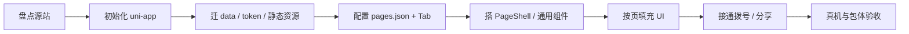

# écho 有求必应官网 → 微信小程序迁移方案

> 文档版本：v1.3  
> 日期：2026-07-21  
> 源工程：`E:\echowebsite`（React 19 + Vite H5）  
> 目标工程：`E:\echowebsite-wechat`（uni-app + Vue 3）  
> **当前进度：阶段 0～3 完成 · 阶段 4 进行中（图标已齐；余包体压缩 + 真机验收）**  
> 进度更新日期：2026-07-21（实勘复核）

---

## 0. 当前进度看板（2026-07-21）

### 0.1 总览

| 阶段 | 名称 | 状态 | 说明 |
| ---- | ---- | ---- | ---- |
| 0 | 工程初始化 | ✅ 已完成 | uni-app 可编译；`mp-weixin.appid` 已配置；DevTools 可预览 |
| 1 | 数据与基础 | ✅ 已完成 | 文案 / Token / 图片 / 字体策略 / Tab / 能力层就绪 |
| 2 | 核心页面填充 | ✅ 已完成 | 首页 / 价格 / 联系（含流程）已落地；真机验收待阶段 4 |
| 3 | 了解更多页 | ✅ 已完成 | 四 Why 区块 + 静态数字/柱图/矩阵；无 GSAP |
| 4 | 打磨与验收 | 🟡 进行中 | 业务/Tab 图标已齐；余图片压缩、主包核验、真机 QA |

**一句话：** 四 Tab 业务内容与图标切图均已落地；阶段 4 剩余项为包体打磨与真机验收（非功能缺口）。

### 0.2 已落地清单

| 类别 | 已有内容 |
| ---- | -------- |
| 工程 | `package.json`（含 `icons:export`）/ `vite.config.js` / `unh.config.js` / Prettier / `README.md` |
| 小程序身份 | `manifest.json` → `appid` / `mp-weixin.appid` = `wx885b7a004f663f3c` |
| 页面路由 | `pages.json` 四 Tab + 正式 tabBar 图标路径 |
| 布局组件 | `PageShell`、`SectionHeader`、`FadeIn` |
| 设计系统 | variables / mixins / reset / responsive / animations / fonts |
| 响应式 | `utils/system.js`（优先 `getWindowInfo` / `getDeviceInfo`）+ PageShell 布局 class |
| 能力层 | `services/phone.js`、`navigation.js`、`share.js`（各页 `onShareAppMessage`） |
| 数据层 | company / about / services / why / pricing / pricingPage / addons / process / contact / nav / icons / assets / home |
| 静态图 | `assets/images/`：logo.png / logo.jpg / logo-horizontal.png / mockup-intro.jpg |
| 图标 | content **29** PNG；tab **8** PNG；脚本 `scripts/export-fa-icons.mjs` |
| 首页 UI | `components/home/*` + `pages/home/index`（Hero 含 Grainient WebGL） |
| 了解更多 UI | `components/about/*` + `pages/about/index` |
| 价格 UI | `components/pricing/{PricingCard,PricingPlanList}` + `pages/pricing/index` |
| 联系 UI | `components/contact/{ServiceProcess,ContactPanel,ClosingQuote}` + `pages/contact/index` |
| 构建产物 | `dist/dev/mp-weixin`（开发）；`dist/build/mp-weixin` ≈ **0.96MB**（主包 &lt; 1.5MB 建议线） |

### 0.3 未完成 / 阻塞点

| 项 | 状态 | 备注 |
| -- | ---- | ---- |
| `mp-weixin.appid` | ✅ | `wx885b7a004f663f3c` |
| 首页四区块 | ✅ | Grainient WebGL 动态背景 + 业务图标 PNG；开场 GSAP 降级 FadeIn |
| 了解更多四 Why | ✅ | 静态数字 / 柱图 / 圆点矩阵；无 GSAP / CountUp |
| 价格真实套餐 UI | ✅ | 四档权益卡横滑；theme light/orange/dark |
| 联系页流程 + 结语 | ✅ | 6 步 + 拨号（phone 图标）+ 咨询按钮（paper-plane-white）+ 结语 |
| `assets/icons/content` 切图 | ✅ | FA → PNG，`npm run icons:export` |
| Tab 正式图标 | ✅ | home / about / pricing / contact（灰 / 橙） |
| 图片压缩清单 | ❌ | logo/mockup 未做 pngquant 等压缩；icon 单文件已很小 |
| 真机验收 | ❌ | 模拟器可跑；iOS/Android 真机 Tab + 拨号未签收 |
| 分享卡片图 | ❌ | 默认文案已接；未配置自定义分享图 |
| `addOnServices` UI | ⚪ 首期不做 | 数据已在 `data/addons.js`；展示归 §17 可选 |
| 品牌字体（mp） | ✅ 定案 | downloadFile→tempPath；H5 用 Zeoseven；见 [`字体CDN策略.md`](./字体CDN策略.md) |

### 0.4 建议下一步

1. 阶段 4 收尾：品牌大图压缩、主包体积再确认、iOS/Android 真机签收  
2. （可选）分享自定义图；了解更多 CountUp；价格页咨询 CTA 深链  
3. （可选）`addOnServices` 增值服务展示（见 §17）

### 0.5 迁移 Review（v1.3）

| 检查项 | 结果 |
| ------ | ---- |
| 文案来自 data，无大段硬编码 | ✅ 四 Tab 均走 `data/*` |
| 无 WebGL / GSAP / Motion / FA 运行时 | ⚠️ Hero 保留同款 Grainient WebGL（自研 canvas，无 ogl）；无 GSAP/Motion/FA 运行时 |
| CTA → 联系我们 Tab | ✅ `goTab('/pages/contact/index')` |
| 页面仅组装、区块在 components | ✅ |
| `mp-weixin` 构建 | ✅ `npm run build:mp-weixin` 通过 |
| 图标与 H5 Dock/业务 FA 对齐 | ✅ 同源 FA 导出色；工具链依赖 `devDependencies` |
| 已知限制 | 宽屏 `is-wide` / 真机字体与拨号待验；地址文案若仍为占位需业务确认 |
| DevTools 噪音 | ℹ️ `getwxaasyncsecinfo` / 游客模式属工具侧，可忽略 |

---

## 1. 背景与目标

### 1.1 背景

现有官网 `echowebsite` 是面向移动端的 **H5 营销单页**：无路由、无后端 API、无全局状态，以底部 Dock 锚点滚动串联「首页 / 了解更多 / 价格 / 联系我们」等板块。视觉上依赖 WebGL、GSAP、Motion 等浏览器侧特效。

目标是将其转化为可在微信内独立运行的 **微信小程序**，代码与静态资源落在 `E:\echowebsite-wechat`。

### 1.2 目标

| 目标     | 说明                                          |
| -------- | --------------------------------------------- |
| 产品形态 | 真正的微信小程序（非 web-view 嵌 H5）         |
| 内容一致 | 品牌、业务、价格、流程、联系方式与官网同源    |
| 体验适配 | 符合小程序交互习惯（多页、Tab、一键拨号）     |
| 可维护   | 业务 / 页面 / 组件 / 能力分层，单文件体量可控 |
| 技术匹配 | 选型贴合团队主栈（Vue + H5 经验）             |

### 1.3 非目标（本期不做）

- 不复刻全部 WebGL / 鼠标光效 / 逐字滚动揭示等高成本特效
- 不做多端（App / 支付宝等）优先；以微信小程序为唯一交付端
- 不接后台 CMS / 登录 / 支付（官网亦无）；联系以电话为主
- 不保留 React / Vite 工程结构直接「编译」成小程序

---

## 2. 技术栈选型

### 2.1 选定方案

**uni-app（Vue 3）+ Vite**，编译目标：**微信小程序**。

| 维度   | 选择                                             | 理由                                  |
| ------ | ------------------------------------------------ | ------------------------------------- |
| 框架   | uni-app                                          | 微信端成熟；页面/组件/路由心智接近 H5 |
| 视图层 | Vue 3（建议 Composition API + `<script setup>`） | 团队主栈为 Vue                        |
| 构建   | Vite（`@dcloudio/vite-plugin-uni`）              | 与常见 H5 工程体验接近                |
| 样式   | SCSS + 设计 Token                                | 承接现有 `variables.css`              |
| 语言   | JavaScript（与源站一致；后续可按需加 TS）        | 降低首期迁移摩擦                      |
| IDE    | HBuilderX 或 VS Code/Cursor + 微信开发者工具     | 日常开发 + 真机预览                   |

### 2.2 为何不选其他方案

| 方案               | 不选原因                                               |
| ------------------ | ------------------------------------------------------ |
| Taro + React       | 源站虽是 React，但团队主栈是 Vue，长期维护成本更高     |
| 原生 WXML          | 能力最「正统」，但与 Vue/H5 经验差距大，工期更长       |
| web-view 嵌现有 H5 | 改动小，但不是小程序体验；能力与审核受限，不作目标形态 |

### 2.3 与源站技术的关系

```
源站 React 组件  ──×──→  不直接复用 JSX
源站 content.js  ──✓──→  拆分迁入 data/
源站 variables   ──✓──→  迁入 styles/variables
源站图片/字体    ──✓──→  迁入 assets/（控制体积）
源站特效库       ──×──→  不迁（ogl / gsap / motion / FA 全量）
```

**核心原则：复用「内容与品牌规范」，重写「壳层与交互」。**

---

## 3. 源站现状摘要

### 3.1 工程画像

| 项   | 现状                                                                 |
| ---- | -------------------------------------------------------------------- |
| 形态 | 单页 SPA，无 Vue Router / React Router                               |
| 导航 | `Dock` + `scrollIntoView`，对应 section id                           |
| 数据 | `src/data/content.js`（约 330 行）为唯一内容源                       |
| 状态 | 仅局部 `useState` / `useRef`                                         |
| API  | 无；联系按钮未真正接通                                               |
| 特效 | Grainient(WebGL)、GSAP ScrollTrigger、Motion Tilt、鼠标 Spotlight 等 |

### 3.2 逻辑板块（非路由）

| Section id | 组件             | 职责                  |
| ---------- | ---------------- | --------------------- |
| `hero`     | `HeroSection`    | 全屏品牌首屏          |
| `company`  | `CompanyIntro`   | 我们是谁 / 品牌理念   |
| `business` | `BusinessIntro`  | 8 项核心业务          |
| （无 id）  | `ContactCTA`     | 中部 CTA，滚到联系    |
| `about`    | `AboutSection`   | 4 个 Why 板块（最重） |
| `pricing`  | `PricingGrid`    | 4 档价格套餐          |
| `process`  | `ServiceStepper` | 6 步服务流程          |
| `contact`  | `ContactInfo`    | 电话 + 结语           |

Dock 导航项：`首页` / `了解更多` / `价格` / `联系我们`（不含 company / business / process）。

### 3.3 主要风险点（迁移时必须处理）

1. **WebGL / GSAP / Motion / 大量 DOM API** → 小程序不可直接使用
2. **Font Awesome 全量注册** → 包体过大，需按需切图或 iconfont 子集
3. **AboutSection 巨石文件**（约 279 行 JSX + 571 行 CSS）→ 必须拆组件
4. **CompanyIntro 文案写死**，未完全读 `content.about` → 迁移时统一走 data
5. **联系电话写在组件内** → 应进入 `data/contact.js`，并用 `uni.makePhoneCall`
6. **hover 光效** → 触屏场景弱化或删除

---

## 4. 整体迁移思路

### 4.1 一句话策略

> 用 uni-app + Vue3 **重建**小程序工程；以「多页面 + Tab」替代「单页锚点」；以「data / services / components / pages」四层解耦；特效降级为轻量视觉，优先保证可读、可点、可打电话。

### 4.2 迁移原则

1. **内容先行**：先迁并拆分 `content.js`，再写 UI，避免文案散落在模板里。
2. **页面变薄**：页面只做组装与生命周期；复杂 UI 下沉为组件。
3. **能力封装**：拨号、跳转、分享进 `services/`，页面不直接散落 `uni.xxx`。
4. **特效克制**：每屏至多 1～2 处有意义动效；不做 WebGL。
5. **包体可控**：主包建议 &lt; 2MB；字体减字重；图标按需。
6. **单一职责**：单文件建议页面 ≤150 行、组件 ≤200 行、样式 ≤300 行、data 单文件 ≤150 行。
7. **不迁死代码**：`ClickSpark`、`useGSAP`、未使用的 `addOnServices` 展示等，首期可不实现（数据可保留在 data 供后续）。

### 4.3 总体流程



---

## 5. 信息架构：H5 → 小程序页面映射

### 5.1 推荐页面结构（4 Tab + 可选流程）

| 小程序路径            | Tab      | 对应 H5                                | 页面职责                                  |
| --------------------- | -------- | -------------------------------------- | ----------------------------------------- |
| `pages/home/index`    | 首页     | hero + company + business + ContactCTA | 品牌首屏 + 公司介绍 + 业务概览 + 引导联系 |
| `pages/about/index`   | 了解更多 | AboutSection                           | 四个 Why 板块（独立页，避免首页过重）     |
| `pages/pricing/index` | 价格     | PricingGrid                            | 四档套餐横向滑动或列表                    |
| `pages/contact/index` | 联系我们 | process + ContactInfo                  | 服务流程 + 电话 + 结语                    |

> `process` 并入联系页：减少 Tab 数量，且「流程 → 联系」转化路径更自然。若后续内容膨胀，可再拆 `pages/process/index`。

### 5.2 导航策略

| 方案          | 说明                     | 建议               |
| ------------- | ------------------------ | ------------------ |
| 原生 `tabBar` | 稳定、省事、符合微信习惯 | **首期推荐**       |
| 自定义 TabBar | 可更接近原 Dock 玻璃拟态 | 二期视觉打磨时再做 |

`pages.json` 中 tab 文案对齐现网：`首页` / `了解更多` / `价格` / `联系我们`。

### 5.3 交互差异对照

| H5                             | 小程序                             |
| ------------------------------ | ---------------------------------- |
| 同页 `scrollIntoView`          | `uni.switchTab` / `uni.navigateTo` |
| 中部 CTA 滚到 contact          | CTA 调用 `switchTab` 到联系页      |
| 点击电话无行为                 | `uni.makePhoneCall`                |
| IntersectionObserver 高亮 Dock | Tab 由系统/自定义 Tab 管理选中态   |
| 鼠标倾斜 / 聚光                | 删除或改为轻微按压缩放             |

---

## 6. 目标工程目录结构

```
E:\echowebsite-wechat\
├── docs/
│   └── 迁移方案.md                 # 本文档
├── src/                            # （若使用 vite 版 uni-app 标准结构）
│   ├── pages/
│   │   ├── home/
│   │   │   ├── index.vue           # 仅组装 sections
│   │   │   └── sections/           # 仅首页使用的区块（可选目录）
│   │   │       ├── HeroSection.vue
│   │   │       ├── CompanyIntro.vue
│   │   │       ├── BusinessIntro.vue
│   │   │       └── ContactCTA.vue
│   │   ├── about/
│   │   │   ├── index.vue
│   │   │   └── sections/           # 四个 Why 拆文件
│   │   │       ├── WhyBrand.vue
│   │   │       ├── WhyLocalLife.vue
│   │   │       ├── WhyCommercialIP.vue
│   │   │       └── WhyChooseUs.vue
│   │   ├── pricing/
│   │   │   └── index.vue
│   │   └── contact/
│   │       ├── index.vue
│   │       └── sections/
│   │           ├── ServiceProcess.vue
│   │           └── ContactPanel.vue
│   │
│   ├── components/                 # 跨页可复用
│   │   ├── layout/
│   │   │   ├── PageShell.vue       # 安全区、背景、统一内边距
│   │   │   └── SectionHeader.vue   # 对应原 ScrollHeader
│   │   ├── marketing/
│   │   │   ├── ServiceCard.vue
│   │   │   ├── PricingCard.vue
│   │   │   ├── ProcessStep.vue
│   │   │   └── StatBlock.vue
│   │   └── feedback/
│   │       ├── FadeIn.vue          # 轻量进入动画（替代 ScrollReveal）
│   │       └── CountUp.vue         # 数字递增（可选、简化）
│   │
│   ├── data/                       # ★ 业务内容（无 UI）
│   │   ├── company.js
│   │   ├── about.js                # whoWeAre / philosophy 等
│   │   ├── services.js
│   │   ├── why.js                  # whySections
│   │   ├── pricing.js
│   │   ├── addons.js               # 增值服务（可暂不渲染）
│   │   ├── process.js
│   │   ├── contact.js              # 电话、结语、地址
│   │   ├── nav.js
│   │   └── index.js                # 统一导出
│   │
│   ├── services/                   # ★ 能力层（无 UI）
│   │   ├── phone.js                # makePhoneCall / 复制号码
│   │   ├── navigation.js           # switchTab / navigateTo 封装
│   │   └── share.js                # onShareAppMessage 文案
│   │
│   ├── utils/
│   │   ├── format.js               # 价格格式化等
│   │   └── system.js               # 安全区、窗口信息
│   │
│   ├── styles/
│   │   ├── variables.scss          # 自 variables.css 迁入
│   │   ├── mixins.scss
│   │   ├── reset.scss
│   │   └── animations.scss         # 仅保留小程序可用 keyframes
│   │
│   ├── assets/
│   │   ├── images/
│   │   │   ├── logo.png
│   │   │   ├── logo-horizontal.png
│   │   │   ├── mockup-intro.jpg
│   │   │   └── hero-bg.jpg         # 替代 Grainient 的静态/渐变底
│   │   ├── icons/                  # 按需图标（替代 FA）
│   │   └── fonts/                  # 建议仅 400/500 两档
│   │
│   ├── App.vue
│   ├── main.js
│   ├── pages.json
│   ├── manifest.json
│   └── uni.scss                    # 注入全局 scss 变量
│
├── package.json
├── vite.config.js
└── project.config.json             # 微信小程序项目配置（或由 uni 生成）
```

> 若脚手架把源码放在根目录而非 `src/`，保持同样分层即可，仅根路径不同。

---

## 7. 分层职责与解耦规范

### 7.1 四层模型

| 层     | 目录                               | 允许                           | 禁止                         |
| ------ | ---------------------------------- | ------------------------------ | ---------------------------- |
| 数据层 | `data/`                            | 文案、列表、价格数字、图标 key | 模板、样式、`uni` API        |
| 能力层 | `services/`                        | 拨号、路由、分享               | 样式、大段文案拼装 DOM       |
| 组件层 | `components/`、`pages/*/sections/` | 展示与局部交互；props 吃 data  | 写死长文案；跨页路由逻辑散落 |
| 页面层 | `pages/*/index.vue`                | 组合 sections、拉 data、页配置 | 内联复杂多分支布局           |

### 7.2 单文件体量建议

| 类型                | 建议上限 | 超出时做法                        |
| ------------------- | -------- | --------------------------------- |
| `pages/*/index.vue` | 150 行   | 把区块拆到 `sections/`            |
| 业务组件 `.vue`     | 200 行   | 再拆子组件                        |
| 单文件样式          | 300 行   | 按区块拆 scss 或 scoped 分段      |
| `data/*.js`         | 150 行   | 按领域继续拆（why 可再拆 4 文件） |

### 7.3 依赖方向（强制）

```
pages → components → data / services / utils
pages → data / services
components ↛ pages          （组件不依赖具体页面）
data ↛ 任何 UI / uni API
```

---

## 8. 数据迁移方案

### 8.1 源 → 目标映射

| 源（`content.js`） | 目标文件           | 备注                                          |
| ------------------ | ------------------ | --------------------------------------------- |
| `company`          | `data/company.js`  | 品牌名、slogan、定位、地址                    |
| `about`            | `data/about.js`    | 统一供 CompanyIntro 使用，消灭硬编码          |
| `services`         | `data/services.js` | 8 项业务；`icon` 字段改为本地图标路径或映射表 |
| `whySections`      | `data/why.js`      | 体积大，可按 id 再拆                          |
| `pricingPlans`     | `data/pricing.js`  | 保留 theme / features / bonus                 |
| `addOnServices`    | `data/addons.js`   | 首期可不渲染，数据可保留                      |
| `serviceProcess`   | `data/process.js`  | 6 步                                          |
| `closingQuote`     | `data/contact.js`  | 与电话一并管理                                |
| `navItems`         | `data/nav.js`      | id 改为 page path                             |
| （组件内电话）     | `data/contact.js`  | `18903073765`、`18923282944`（拨号用纯数字）  |

### 8.2 图标字段改造示例

源站：`icon: 'object-ungroup'`（Font Awesome 名）

小程序建议：

```js
// data/services.js
{
  icon: '/assets/icons/service-local-life.png', // 或 iconKey + 映射表
  title: '本地生活整合运营',
  desc: '...',
}
```

或：

```js
// utils/icons.js
export const iconMap = {
  'object-ungroup': '/assets/icons/object-ungroup.png',
  // ...
}
```

### 8.3 导航数据示例

```js
// data/nav.js
export const tabList = [
  { pagePath: '/pages/home/index', text: '首页', iconKey: 'home' },
  { pagePath: '/pages/about/index', text: '了解更多', iconKey: 'compass' },
  { pagePath: '/pages/pricing/index', text: '价格', iconKey: 'tags' },
  { pagePath: '/pages/contact/index', text: '联系我们', iconKey: 'envelope' },
]
```

---

## 9. 静态资源迁移

### 9.1 必须迁入

| 源路径                         | 目标             | 用途         |
| ------------------------------ | ---------------- | ------------ |
| `public/logo.png` / `logo.jpg` | `assets/images/` | 品牌         |
| `public/logo-horizontal.png`   | `assets/images/` | 横版 Logo    |
| `public/mockup-intro.jpg`      | `assets/images/` | 公司介绍配图 |
| 品牌主色相关导出图（若有）     | `assets/images/` | 首屏背景替代 |

### 9.2 字体策略

**现行定案：** 详见 [`docs/字体CDN策略.md`](./字体CDN策略.md)。

| 端 | 策略 |
| ---- | ---- |
| H5 | **Zeoseven 官方嵌入**（`fonts-h5.scss`） |
| 微信小程序 | `downloadFile`(整档 woff2 CDN) → `loadFontFace`(临时路径)；**不能**用 Zeoseven CSS 分包 |
| 字体族 | `JiangChengYuanTi` |
| 域名 | downloadFile：`cdn.jsdelivr.net` |
| 开关 | `SWITCH.USE_BRAND_FONT` |

小程序不用 Zeoseven「嵌入」CSS 的原因：那是 unicode-range 分包产品，小程序不支持且渲染层拉 HTTPS 会 `ERR_CACHE_MISS`。H5 仍完整使用 Zeoseven。

### 9.3 不迁或替换

| 资源 / 依赖                                                | 处理                               |
| ---------------------------------------------------------- | ---------------------------------- |
| `src/assets/react.svg`、`vite.svg`、`hero.png`（若未使用） | 不迁                               |
| Font Awesome 包                                            | 不迁；导出实际用到的图标为 PNG/SVG |
| Grainient WebGL（ogl / WebGL2）                            | **已移植**：`canvas type="webgl"` + GLSL ES 1.0（`components/shared/Grainient.vue`）；失败回退 CSS 渐变 |
| favicon / icons.svg（Web）                                 | 小程序用各自 tab 图标              |

### 9.4 包体积控制清单

- [ ] 图片压缩（pngquant / tinypng）— **品牌大图待压；icon 已为小体积 PNG**
- [ ] 大图考虑 CDN（若已有域名与合法业务域名配置）
- [x] 图标单个 &lt; 5KB 量级 — **content/tab 导出均远小于 5KB**
- [x] 主包 &lt; 1.5MB 建议 — **当前 `dist/build/mp-weixin` ≈ 0.96MB**（字体子集进包 + 图片已压；上传前再核一次）
- Font Awesome：**不打进运行时**；仅 `devDependencies` + `npm run icons:export` 生成 PNG

---

## 10. 能力与特效映射

### 10.1 保留 / 重写 / 丢弃

| 源能力                 | 策略         | 小程序实现要点                          |
| ---------------------- | ------------ | --------------------------------------- |
| 文案与套餐数据         | **保留**     | `data/*`                                |
| 设计 Token             | **保留**     | `styles/variables.scss`                 |
| Dock 导航              | **重写**     | 原生 tabBar 或自定义 Tab                |
| Hero 背景 Grainient    | **移植**     | WebGL1 canvas 同款着色器；失败回退渐变  |
| ScrollReveal / Text    | **简化**     | `FadeIn` 或直接静态展示                 |
| TiltedCard             | **简化**     | `image` + 圆角阴影                      |
| Spotlight / BorderGlow | **丢弃**     | 静态卡片样式                            |
| CountUp / CircleMatrix | **可选简化** | 首期可静态数字；二期再加                |
| GrowthChart（GSAP）    | **替换**     | 静态条形图或纯 CSS 柱状                 |
| FluidGlass             | **简化**     | 半透明背景 + 边框，勿依赖 backdrop 过度 |
| 联系 CTA               | **增强**     | `services/phone.js` + `navigation.js`   |
| 分享                   | **新增**     | `onShareAppMessage`                     |

### 10.2 能力层接口约定（示例）

```js
// services/phone.js
export function callPhone(phoneNumber) {
  uni.makePhoneCall({ phoneNumber })
}

// services/navigation.js
export function goTab(url) {
  uni.switchTab({ url })
}
```

页面 / 组件内只调用封装函数，便于后续加埋点或确认弹窗。

---

## 11. 页面与组件职责清单

### 11.1 首页 `pages/home`

| 模块            | 职责                     | 数据依赖           |
| --------------- | ------------------------ | ------------------ |
| `HeroSection`   | Logo、slogan、首屏氛围   | `company`          |
| `CompanyIntro`  | 我们是谁、理念摘要、配图 | `about`、`company` |
| `BusinessIntro` | 8 宫格/列表业务卡        | `services`         |
| `ContactCTA`    | 引导至联系 Tab           | `navigation.goTab` |

### 11.2 了解更多 `pages/about`

| 模块              | 职责                       | 数据依赖                    |
| ----------------- | -------------------------- | --------------------------- |
| `WhyBrand`        | 品牌价值点 + 可选矩阵/统计 | `whySections[brand]`        |
| `WhyLocalLife`    | 本地生活 + 增长数据展示    | `whySections[localLife]`    |
| `WhyCommercialIP` | IP 相关 bento              | `whySections[commercialIP]` |
| `WhyChooseUs`     | 选择我们 + 价值观          | `whySections[chooseUs]`     |

> 禁止再合成单一 `AboutSection.vue` 巨石文件。

### 11.3 价格 `pages/pricing`

| 模块                    | 职责          | 数据依赖        |
| ----------------------- | ------------- | --------------- |
| `index` + `PricingCard` | 套餐列表/横滑 | `pricingPlans`  |
| （可选）增值服务列表    | 二期          | `addOnServices` |

### 11.4 联系 `pages/contact`

| 模块             | 职责                 | 数据依赖                             |
| ---------------- | -------------------- | ------------------------------------ |
| `ServiceProcess` | 6 步流程             | `serviceProcess`                     |
| `ContactPanel`   | 电话按钮、地址、结语 | `contact`、`company`、`closingQuote` |

---

## 12. 设计系统迁移

### 12.1 品牌色（与源站一致）

| Token         | 值        |
| ------------- | --------- |
| Primary       | `#FF5500` |
| Primary Light | `#FF8200` |
| Accent        | `#8E49CA` |
| BG            | `#FBFBFB` |
| Text          | `#332C29` |

完整 token 以源站 `src/styles/variables.css` 为准，迁入 `styles/variables.scss`，并通过 `uni.scss` 全局注入。

### 12.2 布局注意点

- 使用 `env(safe-area-inset-bottom)` / `safe-area-inset-top`（uni 提供 CSS 变量或 `pages.json` 配置）
- 价格卡在小屏用横向 `scroll-view`
- rpx 作为主单位；设计稿可按 375 宽度换算
- 避免依赖 `100vh` 的 Web 坑；首屏用 `100vh` 等价的窗口高度 API 或 flex 铺满

### 12.3 动效预算（首期）

建议只做：

1. 页面进入时区块淡入上移（可选）
2. Tab 切换系统默认过渡
3. 按钮点击态（opacity / scale）

不做：WebGL、逐词模糊揭示、鼠标聚光、3D 倾斜。

---

## 13. 分阶段实施计划

> 勾选状态以 **2026-07-21 实勘复核（v1.3）** 为准；`[x]` = 已完成，`[~]` = 部分完成。

### 阶段 0：工程初始化（0.5～1 天）— ✅ 已完成

- [x] 使用官方模板创建 uni-app Vue3 Vite 工程于 `E:\echowebsite-wechat`
- [x] 配置微信小程序 `appid`（`mp-weixin.appid` = `wx885b7a004f663f3c`）
- [x] 建立本文目录骨架（空页面可跑通）
- [x] 接入微信开发者工具预览（打开 `dist/dev|build/mp-weixin`）

### 阶段 1：数据与基础（1 天）— ✅ 已完成

- [x] 拆分迁移 `content.js` → `data/*` — **已完成**（含 about / services / why / pricing / process / addons / home）
- [x] 迁移 `variables` → SCSS
- [x] 迁入 logo / mockup 等图片；确定字体策略 — **详见 `docs/字体CDN策略.md`（包内 woff2 + loadFontFace Data URL）**
- [x] 配置 `pages.json` 四 Tab
- [x] 实现 `PageShell`、`SectionHeader`
- [x] 实现 `services/phone.js`、`navigation.js`（另已有 `share.js`）
- [x] （额外完成）响应式工具 `utils/system.js`、全局样式与 Prettier 工程规范

### 阶段 2：核心页面填充（2～3 天）— ✅ 已完成

- [x] 首页：Hero（Grainient WebGL）+ Company + Business + CTA — **动态背景已移植；开场 GSAP 仍降级为 FadeIn**
- [x] 价格页：四套餐卡片 — **PricingCard + 横滑列表，数据 `pricingPlans`**
- [x] 联系页：流程 + 拨号 + 结语 — **ServiceProcess + ContactPanel + ClosingQuote**
- [ ] 真机点通：Tab 切换、拨打电话 — **能力已接；正式真机验收归阶段 4**

### 阶段 3：了解更多页（2 天）— ✅ 已完成

- [x] 拆四个 Why 区块组件 — **WhyBrand / WhyLocalLife / WhyCommercialIp / WhyChooseUs**
- [x] 统计数字：先静态 — **`StatNumber`（预留后续 CountUp）**
- [x] 增长图：CSS/静态条形 — **`GrowthChartBars`，不引入 GSAP**
- [x] 圆点矩阵静态版 — **`CircleMatrixStatic`（对齐 H5 移动端紧凑布局）**

### 阶段 4：打磨与验收（1～2 天）— 🟡 进行中

- [x] 业务 / Tab 图标 — **FA → PNG（content 29 + tab 8）；`npm run icons:export`**
- [~] 分享文案 — **`share.js` + 各页 `onShareAppMessage` 已接；自定义分享图未做**
- [~] 图片压缩与主包体积正式签收 — **构建约 0.96MB &lt; 1.5MB；真机上传前再核**
- [ ] iOS / Android 真机各测一遍
- [ ] 对照文案清单与源站 PDF/官网一致性抽检

**合计粗估：约 7～10 人日**（视视觉还原精度浮动）。  
**已消耗（估）：约 7～7.5 人日（骨架 + data + 四 Tab + 图标）。剩余主要在压缩签收与真机验收。**

---

## 14. 质量与验收标准

### 14.1 功能验收

- [x] 四 Tab 可切换，选中态正确 — **tabBar 正式图标已接；真机再验**
- [x] 首页可完整阅读品牌与 8 项业务 — **已具备（视觉为小程序简化版）**
- [x] 价格四档信息与源站一致（价格、权益、赠送）
- [x] 联系页可一键拨打两个号码 — **ContactPanel 已接通（模拟器能力可用；真机签收待做）**
- [x] 服务流程 6 步文案正确
- [~] 分享给好友可见标题/图片 — **标题默认已接；自定义分享图未配置**

### 14.2 工程验收

- [x] 无「页面内写死大段业务文案」（应来自 data）— **四 Tab 均来自 data**
- [x] 无单文件超过约定体量而不拆分 — **当前符合**
- [x] `data` 不引用 UI；组件不依赖具体页面路径硬编码（除 navigation 封装）
- [x] 主包体积符合微信限制 — **构建约 0.96MB &lt; 1.5MB 建议线（硬上限 2MB）**

### 14.3 体验验收

- [~] 首屏 2 秒内有品牌识别（Logo + 名称）— **首页已具备；待真机确认**
- [ ] 无明显布局错乱、文字溢出 — **待真机 / 多机型**
- [ ] 底部安全区不被 Tab 遮挡内容 — **待真机确认**

---

## 15. 风险与应对

| 风险                      | 影响             | 应对                                                |
| ------------------------- | ---------------- | --------------------------------------------------- |
| 视觉还原期望 = 官网特效级 | 工期膨胀         | 立项时确认「内容一致 + 品牌色一致」，特效降级已声明 |
| 自定义字体导致包体超限    | 无法上传         | 减字重或改用系统字体                                |
| About 页信息密度过高      | 小程序阅读体验差 | 已拆独立 Tab；组内可再加锚点小标题                  |
| 电话、地址后续变更        | 多处修改         | 只改 `data/contact.js` / `company.js`               |
| uni-app 个别 CSS 不兼容   | 样式偏差         | 避免复杂 `clip-path` / `@property`；用简版样式      |

---

## 16. 开发与联调约定

### 16.1 本地运行（示意）

```bash
# 在 E:\echowebsite-wechat
npm install
npm run dev:mp-weixin
```

用微信开发者工具打开编译输出目录（通常为 `dist/dev/mp-weixin`）。

### 16.2 与源站关系

| 仓库/目录               | 角色                               |
| ----------------------- | ---------------------------------- |
| `E:\echowebsite`        | H5 官网，可持续独立迭代            |
| `E:\echowebsite-wechat` | 小程序，**不反向依赖** H5 构建产物 |

文案若双端长期并存，建议以 `data` 结构为契约；重大文案变更时两边同步（后期可再考虑 monorepo 抽 `shared-content`）。

### 16.3 Git 建议

- `echowebsite-wechat` 独立仓库维护（与 H5 分仓）
- 提交忽略：`node_modules`、`dist`、`unpackage`、微信私密配置中的敏感项

---

## 17. 后续可选增强（不在首期）

1. 自定义玻璃拟态 TabBar（更接近原 Dock）
2. 增值服务 `addOnServices` 展示页
3. 在线表单留资（需后端与隐私合规）
4. 客服能力（微信原生客服按钮）
5. 分包加载 about 重页面
6. 抽离 `shared-content` 供 H5 与小程序共用

---

## 18. 结论

本次迁移采用 **uni-app + Vue 3**，在空目录 `echowebsite-wechat` 重建工程。整体思路是：

1. **多页面 Tab 化** 替代单页锚点滚动；
2. **data / services / components / pages** 严格分层，避免业务与框架耦合；
3. **最大化复用文案与品牌资源**，不复用 React 特效栈；
4. **分阶段交付**：先可浏览可拨号的骨架，再补了解更多与视觉打磨。

确认本方案后，即可进入 **阶段 0：工程初始化**。

> **（进度 v1.3）** 阶段 0～3 与图标切图已完成；请按文首 **§0** 收尾阶段 4（大图压缩签收 + iOS/Android 真机）。

---

## 附录 A：源站关键文件索引

| 路径                                              | 说明             |
| ------------------------------------------------- | ---------------- |
| `echowebsite/src/data/content.js`                 | 全站文案         |
| `echowebsite/src/styles/variables.css`            | 设计 Token       |
| `echowebsite/src/App.jsx`                         | 单页编排         |
| `echowebsite/src/components/Dock.jsx`             | 底部导航         |
| `echowebsite/src/components/home/*`               | 首页相关区块     |
| `echowebsite/src/components/about/AboutSection.*` | 了解更多（最重） |
| `echowebsite/src/components/pricing/*`            | 价格             |
| `echowebsite/src/components/contact/*`            | 流程与联系       |
| `echowebsite/public/*`                            | Logo、配图、字体 |

## 附录 B：联系信息（迁移时写入 data）

| 项     | 值                                   |
| ------ | ------------------------------------ |
| 电话 1 | 189 0307 3765（拨号：`18903073765`） |
| 电话 2 | 189 2328 2944（拨号：`18923282944`） |
| 品牌   | écho / 有求必应品牌策划有限公司      |

（地址以 `content.js` 中 `company.address` 为准；占位地址需业务侧确认后更新。）
